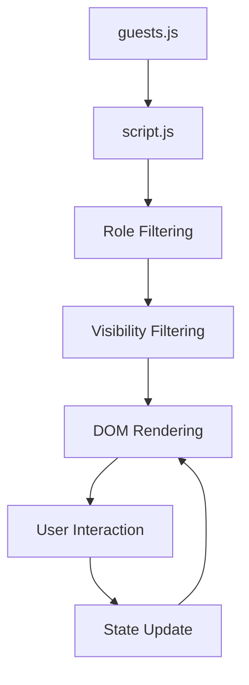
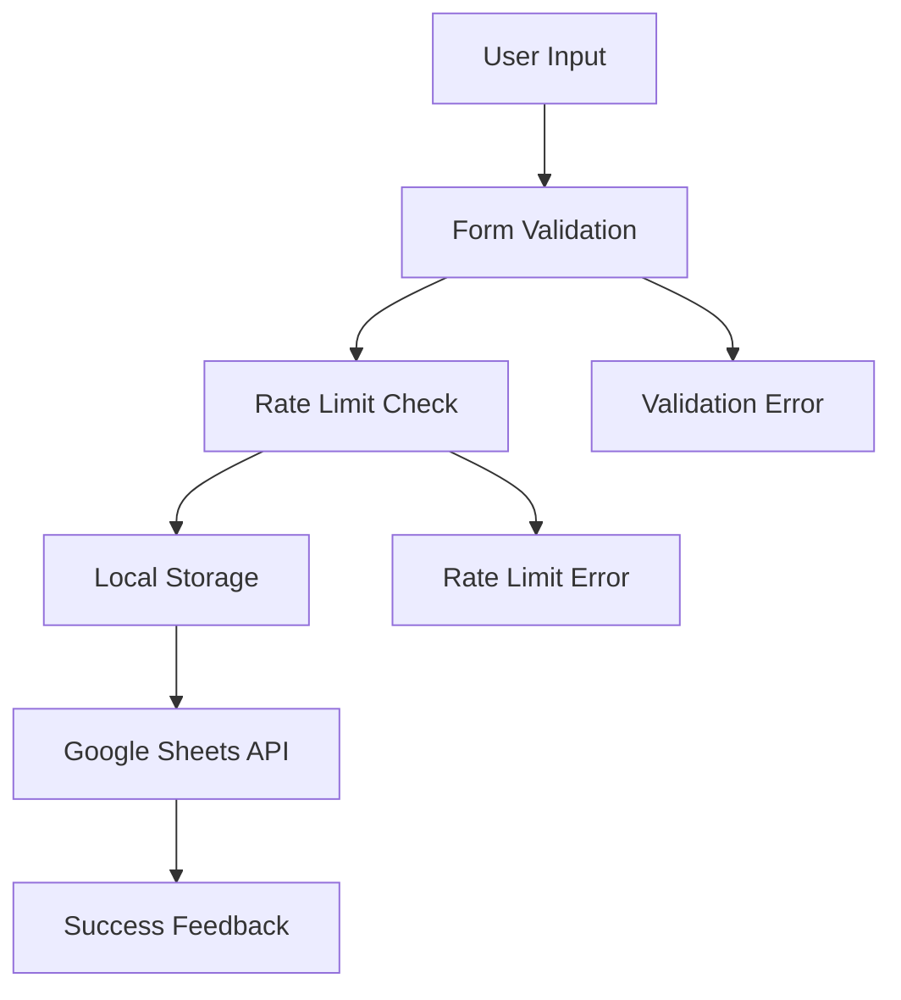

# Data Models & APIs

## 📊 Data Architecture

### Guest Data Model

The core data structure for all event participants:

```javascript
// Guest Object Schema
{
    name: string,                    // Full name (required)
    projects: string,                // Band/project descriptions (required)
    imageUrl: string,                // Standard image path (optional)
    desktopImageUrl: string,         // Desktop-optimized image (optional)
    mobileImageUrl: string,          // Mobile-optimized image (optional)
    role: string,                    // Comma-separated roles (required)
    day: string,                     // Performance day (optional)
    order: number,                   // Display order (optional)
    visibility: number               // 0=hidden, 1=visible (required)
}
```

### Role System

```javascript
// Available Roles
const ROLES = {
    PANELIST: 'panelist',           // Main discussion participants
    PERFORMER: 'performer',         // Live music performers
    MODERATOR: 'moderator',         // Panel facilitators
    STAFF: 'staff',                 // Event organizers
    HOST: 'host',                   // Event host/organizer
    ORGANIZER: 'organizer'          // Event organizer
};

// Role Combinations
// Guests can have multiple roles: "panelist, performer"
// Role filtering: hasRole(guest, 'moderator')
```

### Visibility System

```javascript
// Visibility States
const VISIBILITY = {
    HIDDEN: 0,      // Not shown on website
    VISIBLE: 1      // Shown on website
};

// Usage Examples
const visibleGuests = guests.filter(g => g.visibility === 1);
const hiddenGuests = guests.filter(g => g.visibility === 0);
```

## 🎭 Guest Data Structure

### Complete Guest Object Example

```javascript
{
    name: "Aaron Sprinkle",
    projects: "Poor Old Lu, Rose Blossom Punch, Blank Books, Fair, Moontraveling Podcast",
    imageUrl: "aaron-sprinkle.webp",
    desktopImageUrl: "aaron-sprinkle-p.webp",
    mobileImageUrl: "aaron-sprinkle-p-m.webp",
    role: "panelist, performer",
    day: "Friday",
    order: 1,
    visibility: 0  // Currently hidden
}
```

### Image URL Patterns

```javascript
// Standard Images (2:3 aspect ratio)
imageUrl: "guest-name.webp"

// Performer Images (responsive)
desktopImageUrl: "guest-name-p.webp"    // 3:2 aspect ratio
mobileImageUrl: "guest-name-p-m.webp"   // 4:5 aspect ratio

// Fallback Strategy
// 1. Try WebP format first
// 2. Fall back to original format if WebP fails
// 3. Show placeholder if no image available
```

### Role-Based Filtering

```javascript
// Filter guests by role
function hasRole(guest, role) {
    if (!guest.role) return false;
    return guest.role.split(',').map(r => r.trim().toLowerCase()).includes(role);
}

// Usage Examples
const moderators = guests.filter(g => hasRole(g, 'moderator'));
const performers = guests.filter(g => hasRole(g, 'performer'));
const panelists = guests.filter(g => hasRole(g, 'panelist'));
const staff = guests.filter(g => hasRole(g, 'staff'));
```

## 📝 Question Submission System

### Question Data Model

```javascript
// Question Object Schema
{
    id: string,                     // Unique identifier
    question: string,               // Question text (max 140 chars)
    submitter: string,              // Submitter name (optional)
    email: string,                  // Email for responses (optional)
    timestamp: string,              // ISO timestamp
    panelist: string                // Target guest name
}
```

### Local Storage Schema

```javascript
// Storage Keys
const STORAGE_KEYS = {
    QUESTIONS: 'tomcon_stored_questions_',     // + panelist name
    DRAFTS: 'tomcon_draft_',                  // + panelist name
    RATE_LIMITS: 'tomcon_questions_',         // + panelist + submitter
    DEVICE_LIMITS: 'tomcon_device_'           // + panelist
};

// Example Storage Structure
localStorage.setItem('tomcon_stored_questions_Aaron Sprinkle', JSON.stringify([
    {
        id: 'q_1704067200000_abc123',
        question: 'What was your favorite album to record?',
        submitter: 'John Doe',
        email: 'john@example.com',
        timestamp: '2024-01-01T00:00:00.000Z'
    }
]));
```

### Rate Limiting System

```javascript
// Rate Limit Configuration
const RATE_LIMITS = {
    USER_LIMIT: 2,          // Questions per user per artist
    DEVICE_LIMIT: 3,        // Questions per device per artist
    CHARACTER_LIMIT: 140    // Characters per question
};

// Rate Limit Check
function checkRateLimit(panelist, submitter) {
    const userCount = getSubmissionCount(panelist, submitter);
    const deviceCount = getDeviceSubmissionCount(panelist);
    
    if (userCount >= RATE_LIMITS.USER_LIMIT) {
        return {
            allowed: false,
            type: 'user',
            message: `You have already submitted ${RATE_LIMITS.USER_LIMIT} questions for ${panelist}`
        };
    }
    
    if (deviceCount >= RATE_LIMITS.DEVICE_LIMIT) {
        return {
            allowed: false,
            type: 'device',
            message: `This device has already submitted ${RATE_LIMITS.DEVICE_LIMIT} questions for ${panelist}`
        };
    }
    
    return { allowed: true };
}
```

## 🔌 External API Integrations

### Google Sheets API

```javascript
// Question Submission Endpoint
const GOOGLE_SHEETS_API = {
    BASE_URL: 'https://script.google.com/macros/s/AKfycbyQ6ieJ4962J7_fm-WC-0hj-oqZtgJN0mBcrfzYVsTiIVF7uXiFNT5cIU9vwL2Zj0naCQ/exec',
    
    // Submit Question
    SUBMIT: (params) => {
        const url = `${BASE_URL}?${new URLSearchParams({
            panelist: params.panelist,
            question: params.question,
            submitter: params.submitter,
            email: params.email,
            questionId: params.questionId
        })}`;
        
        return fetch(url, {
            method: 'GET',
            mode: 'no-cors'  // CORS handling
        });
    },
    
    // Delete Question
    DELETE: (questionId, panelist) => {
        const url = `${BASE_URL}?action=delete&questionId=${questionId}&panelist=${panelist}`;
        
        return fetch(url, {
            method: 'GET',
            mode: 'no-cors'
        });
    }
};
```

### Pretix Ticketing Widget

```html
<!-- Pretix Widget Integration -->
<pretix-widget 
    event="https://checkout.tomconvention.com/"
    style="color: #482124;">
</pretix-widget>

<!-- Widget Configuration -->
<script type="text/javascript" 
        src="https://checkout.tomconvention.com/widget/v2.en.js" 
        async 
        crossorigin>
</script>
```

### EmailOctopus Integration

```html
<!-- EmailOctopus Form -->
<script async 
        src="https://eomail6.com/form/6625d4d6-7f0c-11f0-9af9-bd5ee8066298.js" 
        data-form="6625d4d6-7f0c-11f0-9af9-bd5ee8066298">
</script>
```

## 🎨 UI State Management

### Card State Machine

```javascript
// Card States
const CARD_STATES = {
    NORMAL: 'normal',               // Default state
    FLIPPED: 'flipped',            // Forward flip (bottom half click)
    FLIPPED_REVERSE: 'flipped-reverse', // Reverse flip (top half click)
    CLOSING: 'closing'             // Transitioning back to normal
};

// State Transitions
const stateTransitions = {
    [CARD_STATES.NORMAL]: [CARD_STATES.FLIPPED, CARD_STATES.FLIPPED_REVERSE],
    [CARD_STATES.FLIPPED]: [CARD_STATES.CLOSING],
    [CARD_STATES.FLIPPED_REVERSE]: [CARD_STATES.CLOSING],
    [CARD_STATES.CLOSING]: [CARD_STATES.NORMAL]
};
```

### Form State Management

```javascript
// Question Form States
const FORM_STATES = {
    EMPTY: 0,           // No questions submitted
    ONE_QUESTION: 1,    // 1 question submitted
    FULL: 2             // 2 questions submitted (limit reached)
};

// State-based UI Rendering
function renderCardBack(guestName) {
    const questionCount = getStoredQuestions(guestName).length;
    
    switch (questionCount) {
        case FORM_STATES.EMPTY:
            return renderEmptyForm(guestName);
        case FORM_STATES.ONE_QUESTION:
            return renderFormWithList(guestName);
        case FORM_STATES.FULL:
            return renderListOnly(guestName);
    }
}
```

### Keyboard Navigation State

```javascript
// Keyboard Navigation State
const keyboardState = {
    enabled: false,
    currentFocusedCard: null,
    sections: [
        { heading: 'moderators', grid: 'moderator-grid' },
        { heading: 'performers', grid: 'performer-grid' },
        { heading: 'featured-guests', grid: 'guest-grid' },
        { heading: 'staff', grid: 'staff-grid' }
    ]
};
```

## 📊 Data Validation

### Guest Data Validation

```javascript
// Guest Object Validation
function validateGuest(guest) {
    const errors = [];
    
    if (!guest.name || typeof guest.name !== 'string') {
        errors.push('Name is required and must be a string');
    }
    
    if (!guest.projects || typeof guest.projects !== 'string') {
        errors.push('Projects is required and must be a string');
    }
    
    if (!guest.role || typeof guest.role !== 'string') {
        errors.push('Role is required and must be a string');
    }
    
    if (typeof guest.visibility !== 'number' || ![0, 1].includes(guest.visibility)) {
        errors.push('Visibility must be 0 (hidden) or 1 (visible)');
    }
    
    return {
        isValid: errors.length === 0,
        errors
    };
}
```

### Question Validation

```javascript
// Question Validation
function validateQuestion(question, submitter, email) {
    const errors = [];
    
    if (!question || question.trim().length === 0) {
        errors.push('Question is required');
    }
    
    if (question && question.length > 140) {
        errors.push('Question must be 140 characters or less');
    }
    
    if (email && !isValidEmail(email)) {
        errors.push('Email format is invalid');
    }
    
    return {
        isValid: errors.length === 0,
        errors
    };
}

function isValidEmail(email) {
    const emailRegex = /^[^\s@]+@[^\s@]+\.[^\s@]+$/;
    return emailRegex.test(email);
}
```

## 🔄 Data Flow Architecture

### Guest Data Flow



### Question Submission Flow



## 🛡️ Data Security

### Input Sanitization

```javascript
// HTML Sanitization
function sanitizeInput(input) {
    const div = document.createElement('div');
    div.textContent = input;
    return div.innerHTML;
}

// XSS Prevention
function safeSetInnerHTML(element, content) {
    element.innerHTML = sanitizeInput(content);
}
```

### Data Privacy

```javascript
// Privacy Considerations
const PRIVACY_SETTINGS = {
    // Email collection is optional
    EMAIL_OPTIONAL: true,
    
    // Data retention
    LOCAL_STORAGE_EXPIRY: 30 * 24 * 60 * 60 * 1000, // 30 days
    
    // Anonymization
    ANONYMIZE_SUBMITTER: false  // Keep submitter names for attribution
};
```

## 📈 Performance Data

### Bundle Analysis

```javascript
// Bundle Size Targets
const BUNDLE_TARGETS = {
    TOTAL_JS: 200,           // KB
    TOTAL_CSS: 50,           // KB
    TOTAL_IMAGES: 500,       // KB (compressed)
    FIRST_LOAD: 300          // KB (critical path)
};

// Current Bundle Sizes
const currentSizes = {
    main: 45.2,              // KB
    guests: 12.8,            // KB
    vendor: 8.1,             // KB
    total: 66.1              // KB
};
```

### Image Optimization Metrics

```javascript
// Image Optimization Results
const imageStats = {
    totalImages: 172,
    webpImages: 81,
    jpgImages: 79,
    pngImages: 6,
    averageCompression: 65,  // %
    totalSavings: 2.3        // MB
};
```

---

**Next**: [Development Setup](./04-development-setup.md)
