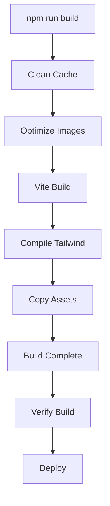

# Build & Deployment

## 🏗️ Build Process

### Build Pipeline Overview



### Build Script Breakdown

```bash
# Complete build command
npm run build

# Equivalent to:
rm -rf dist .vite && \
npm run optimize-images && \
vite build && \
tailwindcss -i ./input.css -o ./dist/output.css && \
cp style.css dist/
```

### Step-by-Step Build Process

#### 1. Cache Cleaning
```bash
# Remove previous builds and Vite cache
rm -rf dist .vite

# Ensures fresh build without stale files
```

#### 2. Image Optimization
```bash
# Convert and optimize images to WebP
npm run optimize-images

# Process:
# - Convert JPG/PNG to WebP format
# - Resize images to max 1200x1200
# - Apply 80% quality compression
# - Generate responsive variants for performers
```

#### 3. Vite Build
```bash
# Bundle JavaScript and HTML
vite build

# Features:
# - Code splitting and tree shaking
# - Minification with Terser
# - Asset optimization
# - Source map generation (dev only)
```

#### 4. CSS Compilation
```bash
# Compile Tailwind CSS
tailwindcss -i ./input.css -o ./dist/output.css

# Process:
# - Purge unused CSS classes
# - Minify CSS output
# - Generate optimized stylesheet
```

#### 5. Asset Copying
```bash
# Copy custom styles
cp style.css dist/

# Ensures custom styles are available in production
```

## 🔍 Build Verification

### Verification Process

```bash
# Run build verification
npm run verify

# Checks performed:
# 1. Guest visibility validation
# 2. Critical data integrity
# 3. Build freshness
# 4. File existence
```

### Verification Script (`verify-build.js`)

```javascript
// Verification checks
const verificationChecks = {
    // 1. Visible guests check
    visibleGuests: {
        description: 'All guests with visibility: 1 are present',
        check: () => validateGuestVisibility(1)
    },
    
    // 2. Hidden guests check
    hiddenGuests: {
        description: 'Guests with visibility: 0 are correctly marked',
        check: () => validateGuestVisibility(0)
    },
    
    // 3. Critical data check
    criticalData: {
        description: 'Recent critical changes are included',
        check: () => validateCriticalGuests()
    },
    
    // 4. Build freshness check
    buildFreshness: {
        description: 'Build is recent and not stale',
        check: () => validateBuildAge()
    }
};
```

### Critical Guest Validation

```javascript
// Critical guests that must be validated
const criticalGuests = [
    { name: 'Deanna Moody', shouldBeVisible: true },
    { name: 'Josh Kemble', shouldBeVisible: false },
    { name: 'Kevin Chen', shouldBeVisible: true }
];

// Validation logic
function validateCriticalGuests() {
    criticalGuests.forEach(({ name, shouldBeVisible }) => {
        const guestEntry = findGuestInBuild(name);
        const isVisible = guestEntry?.visibility === 1;
        
        if (isVisible !== shouldBeVisible) {
            throw new Error(`${name} visibility incorrect: expected ${shouldBeVisible}, got ${isVisible}`);
        }
    });
}
```

### Build Verification Output

```bash
# Success output
✅ All 66 visible guests found in build
✅ All 3 hidden guests correctly marked
✅ Deanna Moody correctly visible in build
✅ Josh Kemble correctly hidden in build
✅ Kevin Chen correctly visible in build
✅ Build is fresh (45s old)

✅ BUILD VERIFICATION PASSED!
Build is ready for deployment.

# Failure output
❌ Missing 1 visible guests in build:
  - New Guest Name

❌ BUILD VERIFICATION FAILED!
Please fix the errors above before deploying.
```

## 🚀 Deployment Process

### Deployment Script (`deploy.sh`)

```bash
#!/bin/bash

# Server configuration
SERVER_HOST="82.29.86.169"
SERVER_USER="u780736690"
SERVER_PORT="65002"
REMOTE_PATH="/home/u780736690/domains/tomconvention.com/public_html"

# Deployment workflow
./deploy.sh
```

### Deployment Steps

#### 1. Pre-deployment Checks
```bash
# Verify build directory exists
if [ ! -d "$LOCAL_PATH" ] || [ -z "$(ls -A $LOCAL_PATH)" ]; then
    echo "Build directory is missing or empty!"
    exit 1
fi

# Run build verification
npm run verify
if [ $? -ne 0 ]; then
    echo "Build verification failed!"
    exit 1
fi
```

#### 2. Server Connection Test
```bash
# Test SSH connection
ssh -p "$SERVER_PORT" -o ConnectTimeout=10 "$SERVER_USER@$SERVER_HOST" exit

# Verify connection before proceeding
```

#### 3. Backup Creation
```bash
# Create backup of current deployment
ssh -p "$SERVER_PORT" "$SERVER_USER@$SERVER_HOST" "
    if [ -d '$REMOTE_PATH' ]; then
        cp -r '$REMOTE_PATH' '${REMOTE_PATH}_backup_$(date +%Y%m%d_%H%M%S)'
    fi
"
```

#### 4. File Deployment
```bash
# Deploy files using rsync
rsync -avz --progress \
    -e "ssh -p $SERVER_PORT" \
    --exclude=deploy.sh \
    --exclude=.git \
    --exclude=*.md \
    --exclude=.DS_Store \
    --delete \
    "$LOCAL_PATH/" \
    "$SERVER_USER@$SERVER_HOST:$REMOTE_PATH/"
```

#### 5. Post-deployment Tasks
```bash
# Set proper permissions
chmod -R 644 '$REMOTE_PATH'/*
find '$REMOTE_PATH' -type d -exec chmod 755 {} \;

# Create .htaccess for cache control
cat >> '$REMOTE_PATH/.htaccess' << 'EOF'
<IfModule mod_headers.c>
    <FilesMatch "\.html$">
        Header set Cache-Control "max-age=300, must-revalidate"
    </FilesMatch>
    <FilesMatch "\.(jpg|jpeg|png|gif|webp|svg)$">
        Header set Cache-Control "max-age=3600, must-revalidate"
    </FilesMatch>
    <FilesMatch "\.(css|js)$">
        Header set Cache-Control "max-age=86400, must-revalidate"
    </FilesMatch>
</IfModule>
EOF
```

## 📊 Build Output Analysis

### Bundle Analysis

```javascript
// Bundle size targets
const bundleTargets = {
    totalJS: 200,        // KB
    totalCSS: 50,        // KB
    totalImages: 500,    // KB
    firstLoad: 300       // KB
};

// Current bundle sizes
const currentSizes = {
    main: 45.2,          // KB - Core application
    guests: 12.8,        // KB - Guest data
    vendor: 8.1,         // KB - Third-party libraries
    vendorLucide: 3.2,   // KB - Icon library
    total: 69.3          // KB - Total JavaScript
};
```

### Code Splitting Strategy

```javascript
// Vite manual chunks configuration
manualChunks: (id) => {
    if (id.includes('node_modules')) {
        if (id.includes('lucide')) {
            return 'vendor-lucide';  // Separate icon bundle
        }
        return 'vendor';             // Other third-party code
    }
    if (id.includes('guests.js')) {
        return 'guests';             // Guest data bundle
    }
    if (id.includes('script.js')) {
        return 'main';               // Main application
    }
}
```

### Asset Optimization

```javascript
// Image optimization results
const imageOptimization = {
    totalImages: 172,
    webpImages: 81,
    jpgImages: 79,
    pngImages: 6,
    averageCompression: 65,  // % size reduction
    totalSavings: 2.3        // MB saved
};

// CSS optimization
const cssOptimization = {
    tailwindPurged: 95,      // % of unused classes removed
    customCSS: 12.5,         // KB custom styles
    totalCSS: 15.2           // KB total CSS
};
```

## 🔧 Build Configuration

### Vite Build Configuration

```javascript
// vite.config.js
export default defineConfig({
  build: {
    outDir: 'dist',
    rollupOptions: {
      input: {
        main: './index.html',
        privacy: './privacy.html',
        terms: './terms.html',
        refunds: './refunds.html'
      },
      output: {
        chunkFileNames: 'assets/[name]-[hash].js',
        entryFileNames: 'assets/[name]-[hash].js',
        assetFileNames: 'assets/[name]-[hash].[ext]'
      }
    },
    cssCodeSplit: false,     // Single CSS file
    minify: 'terser',        // JavaScript minification
    terserOptions: {
      compress: {
        drop_console: true,  // Remove console.log in production
        drop_debugger: true  // Remove debugger statements
      }
    }
  }
});
```

### Tailwind Build Configuration

```javascript
// tailwind.config.js
module.exports = {
  content: [
    "./index.html",
    "./privacy.html",
    "./terms.html", 
    "./refunds.html",
    "./script.js",
    "./guests.js",
    "./style.css"
  ],
  theme: {
    extend: {
      screens: {
        'xs': '375px'        // Custom breakpoint
      }
    }
  }
};
```

## 🚨 Error Handling

### Build Error Recovery

```bash
# Common build errors and solutions

# Error: Build directory not found
# Solution: Run npm run build first
npm run build

# Error: Guest data not found
# Solution: Check guests.js file exists and is valid
node -e "console.log(require('./guests.js'))"

# Error: Image optimization failed
# Solution: Check image files and permissions
ls -la images/
npm run optimize-images

# Error: Tailwind compilation failed
# Solution: Check Tailwind configuration
npx tailwindcss -i ./input.css -o ./output.css --watch
```

### Deployment Error Recovery

```bash
# Error: SSH connection failed
# Solution: Check server configuration and SSH key
ssh -p 65002 u780736690@82.29.86.169

# Error: Permission denied
# Solution: Check file permissions and user access
ssh -p 65002 u780736690@82.29.86.169 "ls -la /home/u780736690/domains/tomconvention.com/"

# Error: Build verification failed
# Solution: Fix guest data and rebuild
npm run build
npm run verify
```

## 📈 Performance Monitoring

### Build Performance Metrics

```javascript
// Build time tracking
const buildMetrics = {
    imageOptimization: 45,   // seconds
    viteBuild: 12,           // seconds
    tailwindCompilation: 3,  // seconds
    totalBuildTime: 60       // seconds
};

// Bundle analysis
const bundleAnalysis = {
    totalSize: 69.3,         // KB
    gzippedSize: 23.1,       // KB
    compressionRatio: 66.7,  // %
    loadTime: 1.2            // seconds (3G)
};
```

### Deployment Monitoring

```bash
# Monitor deployment progress
rsync -avz --progress \
    -e "ssh -p $SERVER_PORT" \
    "$LOCAL_PATH/" \
    "$SERVER_USER@$SERVER_HOST:$REMOTE_PATH/"

# Check deployment status
ssh -p "$SERVER_PORT" "$SERVER_USER@$SERVER_HOST" "
    echo 'Deployment completed at:' $(date)
    echo 'Files deployed:' $(find '$REMOTE_PATH' -type f | wc -l)
    echo 'Total size:' $(du -sh '$REMOTE_PATH')
"
```

## 🔄 Rollback Strategy

### Automatic Backup

```bash
# Backup created before each deployment
BACKUP_NAME="${REMOTE_PATH}_backup_$(date +%Y%m%d_%H%M%S)"

# Rollback command
ssh -p "$SERVER_PORT" "$SERVER_USER@$SERVER_HOST" "
    if [ -d '$BACKUP_NAME' ]; then
        rm -rf '$REMOTE_PATH'
        mv '$BACKUP_NAME' '$REMOTE_PATH'
        echo 'Rollback completed'
    else
        echo 'Backup not found: $BACKUP_NAME'
    fi
"
```

### Manual Rollback

```bash
# List available backups
ssh -p "$SERVER_PORT" "$SERVER_USER@$SERVER_HOST" "ls -la /home/u780736690/domains/tomconvention.com/ | grep backup"

# Restore specific backup
ssh -p "$SERVER_PORT" "$SERVER_USER@$SERVER_HOST" "
    rm -rf '$REMOTE_PATH'
    mv '${REMOTE_PATH}_backup_20250101_120000' '$REMOTE_PATH'
"
```

## 🎯 Deployment Checklist

### Pre-deployment

- [ ] All changes committed to git
- [ ] Guest data updated in `guests.js`
- [ ] Images optimized and added
- [ ] Local testing completed
- [ ] Build verification passes

### During Deployment

- [ ] Build process completes successfully
- [ ] Verification passes
- [ ] SSH connection established
- [ ] Backup created
- [ ] Files deployed successfully
- [ ] Permissions set correctly

### Post-deployment

- [ ] Website loads correctly
- [ ] All pages accessible
- [ ] Images load properly
- [ ] Interactive features work
- [ ] Performance metrics acceptable
- [ ] No console errors

---

**Next**: [Performance & Optimization](./06-performance-optimization.md)
