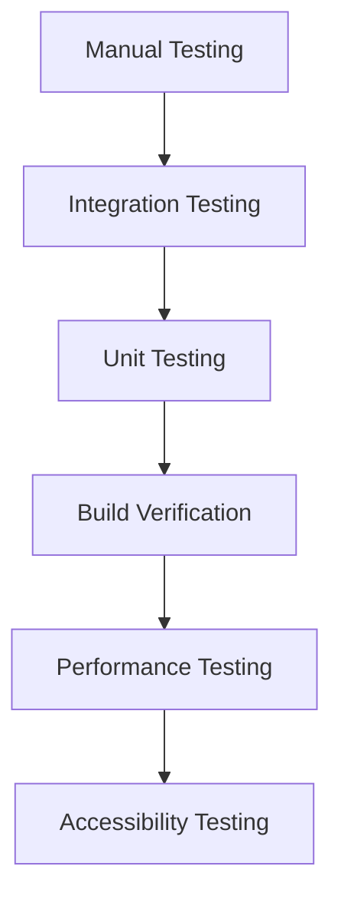

# Testing & Quality Assurance

## 🧪 Testing Strategy

### Testing Pyramid



### Testing Levels

```javascript
// Testing hierarchy
const testingLevels = {
    // Level 1: Unit Testing
    unit: {
        scope: 'Individual functions and components',
        tools: ['Jest', 'Mocha', 'Manual testing'],
        coverage: 'Critical business logic'
    },
    
    // Level 2: Integration Testing
    integration: {
        scope: 'Component interactions and data flow',
        tools: ['Manual testing', 'Browser dev tools'],
        coverage: 'User workflows and API integrations'
    },
    
    // Level 3: System Testing
    system: {
        scope: 'End-to-end user scenarios',
        tools: ['Manual testing', 'Lighthouse', 'Browser testing'],
        coverage: 'Complete user journeys'
    },
    
    // Level 4: Acceptance Testing
    acceptance: {
        scope: 'Business requirements validation',
        tools: ['Stakeholder review', 'User testing'],
        coverage: 'User satisfaction and business goals'
    }
};
```

## 🔍 Manual Testing

### Functional Testing Checklist

#### Core Functionality

```bash
# Card System Testing
- [ ] Guest cards display correctly
- [ ] Card flip animations work smoothly
- [ ] Question submission system functions
- [ ] Rate limiting works correctly
- [ ] Form validation operates properly
- [ ] Local storage saves/loads data
- [ ] Question deletion works
- [ ] Success feedback displays

# Navigation Testing
- [ ] Keyboard navigation (WASD/Arrow keys)
- [ ] Section navigation works
- [ ] Focus indicators visible
- [ ] Escape key exits modes
- [ ] B-key toggles project overlays

# Responsive Testing
- [ ] Mobile layout (375px+)
- [ ] Tablet layout (640px+)
- [ ] Desktop layout (1024px+)
- [ ] Touch interactions work
- [ ] Images scale properly
- [ ] Text remains readable
```

#### Performance Testing

```bash
# Load Time Testing
- [ ] Initial page load < 3 seconds
- [ ] Images load progressively
- [ ] Lazy loading works correctly
- [ ] No layout shifts during loading
- [ ] Smooth animations at 60fps

# Network Testing
- [ ] Works on slow 3G connection
- [ ] Graceful degradation without JS
- [ ] Offline functionality (basic)
- [ ] Error handling for failed requests
- [ ] Retry mechanisms work
```

#### Accessibility Testing

```bash
# Keyboard Navigation
- [ ] Tab order is logical
- [ ] All interactive elements focusable
- [ ] Focus indicators visible
- [ ] Skip links work
- [ ] Modal focus trapping

# Screen Reader Testing
- [ ] Content is announced correctly
- [ ] Form labels associated properly
- [ ] Error messages announced
- [ ] Dynamic content updates announced
- [ ] Heading hierarchy correct

# Visual Testing
- [ ] Color contrast meets WCAG AA
- [ ] Text scales to 200% without issues
- [ ] No information conveyed by color alone
- [ ] Focus indicators meet contrast requirements
```

### Cross-Browser Testing

```javascript
// Browser compatibility matrix
const browserTesting = {
    // Primary browsers (must work perfectly)
    primary: {
        'Chrome 90+': {
            desktop: true,
            mobile: true,
            priority: 'high'
        },
        'Firefox 88+': {
            desktop: true,
            mobile: true,
            priority: 'high'
        },
        'Safari 14+': {
            desktop: true,
            mobile: true,
            priority: 'high'
        },
        'Edge 90+': {
            desktop: true,
            mobile: true,
            priority: 'high'
        }
    },
    
    // Secondary browsers (should work)
    secondary: {
        'Chrome Mobile 90+': {
            mobile: true,
            priority: 'medium'
        },
        'Safari iOS 14+': {
            mobile: true,
            priority: 'medium'
        }
    }
};
```

### Device Testing

```javascript
// Device testing matrix
const deviceTesting = {
    // Mobile devices
    mobile: {
        'iPhone 12': { width: 390, height: 844 },
        'iPhone SE': { width: 375, height: 667 },
        'Samsung Galaxy S21': { width: 384, height: 854 },
        'Google Pixel 5': { width: 393, height: 851 }
    },
    
    // Tablet devices
    tablet: {
        'iPad': { width: 768, height: 1024 },
        'iPad Pro': { width: 1024, height: 1366 },
        'Samsung Galaxy Tab': { width: 800, height: 1280 }
    },
    
    // Desktop devices
    desktop: {
        'MacBook Air': { width: 1440, height: 900 },
        'Dell XPS': { width: 1920, height: 1080 },
        'Ultrawide Monitor': { width: 2560, height: 1440 }
    }
};
```

## 🔧 Build Verification

### Automated Build Testing

```javascript
// Build verification script (verify-build.js)
const buildVerification = {
    // Guest data validation
    guestValidation: {
        visibleGuests: 'All guests with visibility: 1 are present',
        hiddenGuests: 'Guests with visibility: 0 are correctly marked',
        criticalGuests: 'Recent critical changes are included'
    },
    
    // Build integrity
    buildIntegrity: {
        fileExistence: 'All required files are present',
        bundleSize: 'Bundle sizes are within limits',
        buildFreshness: 'Build is recent and not stale'
    },
    
    // Performance checks
    performanceChecks: {
        imageOptimization: 'Images are optimized to WebP',
        cssPurging: 'Unused CSS classes are removed',
        jsMinification: 'JavaScript is minified'
    }
};
```

### Critical Guest Validation

```javascript
// Critical guests that must be validated
const criticalGuests = [
    { name: 'Deanna Moody', shouldBeVisible: true },
    { name: 'Josh Kemble', shouldBeVisible: false },
    { name: 'Kevin Chen', shouldBeVisible: true }
];

// Validation function
function validateCriticalGuests() {
    const errors = [];
    
    criticalGuests.forEach(({ name, shouldBeVisible }) => {
        const guestEntry = findGuestInBuild(name);
        const isVisible = guestEntry?.visibility === 1;
        
        if (isVisible !== shouldBeVisible) {
            errors.push(`${name} visibility incorrect: expected ${shouldBeVisible}, got ${isVisible}`);
        }
    });
    
    return errors;
}
```

## 🚀 Performance Testing

### Core Web Vitals Testing

```javascript
// Performance testing configuration
const performanceTesting = {
    // Core Web Vitals targets
    targets: {
        LCP: 2.5,           // Largest Contentful Paint (seconds)
        FID: 100,           // First Input Delay (milliseconds)
        CLS: 0.1,           // Cumulative Layout Shift
        FCP: 1.8,           // First Contentful Paint (seconds)
        TTI: 3.8            // Time to Interactive (seconds)
    },
    
    // Testing tools
    tools: {
        lighthouse: 'Automated performance auditing',
        webpagetest: 'Real-world performance testing',
        chromeDevTools: 'Development performance profiling'
    }
};
```

### Load Testing

```javascript
// Load testing scenarios
const loadTesting = {
    // Concurrent users
    scenarios: {
        light: { users: 10, duration: '5m' },
        medium: { users: 50, duration: '10m' },
        heavy: { users: 100, duration: '15m' }
    },
    
    // Performance metrics
    metrics: {
        responseTime: '< 2 seconds',
        errorRate: '< 1%',
        throughput: '> 100 requests/second'
    }
};
```

### Image Performance Testing

```javascript
// Image optimization testing
const imageTesting = {
    // Image format testing
    formatTesting: {
        webp: 'Primary format for modern browsers',
        jpg: 'Fallback format for older browsers',
        png: 'Fallback for images with transparency'
    },
    
    // Size optimization
    sizeOptimization: {
        targetCompression: '60-80% size reduction',
        maxWidth: 1200,
        maxHeight: 1200,
        quality: 80
    },
    
    // Loading performance
    loadingPerformance: {
        lazyLoading: 'Images load when in viewport',
        progressiveLoading: 'Images load progressively',
        fallbackHandling: 'Graceful fallback for failed loads'
    }
};
```

## ♿ Accessibility Testing

### WCAG 2.1 AA Compliance

```javascript
// Accessibility testing checklist
const accessibilityTesting = {
    // Perceivable
    perceivable: {
        colorContrast: '4.5:1 minimum contrast ratio',
        textScaling: 'Text scales to 200% without issues',
        alternativeText: 'All images have descriptive alt text',
        captions: 'Video content has captions (if applicable)'
    },
    
    // Operable
    operable: {
        keyboardAccess: 'All functionality available via keyboard',
        noSeizures: 'No content flashes more than 3 times per second',
        navigation: 'Clear navigation and skip links',
        timeouts: 'No time limits on content consumption'
    },
    
    // Understandable
    understandable: {
        language: 'Page language is specified',
        consistentNavigation: 'Navigation is consistent across pages',
        errorIdentification: 'Errors are clearly identified',
        help: 'Help is available for complex tasks'
    },
    
    // Robust
    robust: {
        validMarkup: 'HTML is valid and well-formed',
        assistiveTechnology: 'Compatible with assistive technologies',
        futureProof: 'Works with future technologies'
    }
};
```

### Screen Reader Testing

```javascript
// Screen reader testing
const screenReaderTesting = {
    // Testing tools
    tools: {
        nvda: 'Free Windows screen reader',
        jaws: 'Commercial Windows screen reader',
        voiceover: 'Built-in macOS screen reader',
        talkback: 'Built-in Android screen reader'
    },
    
    // Testing scenarios
    scenarios: {
        navigation: 'Navigate through all sections',
        forms: 'Complete question submission forms',
        interactions: 'Use all interactive elements',
        announcements: 'Verify dynamic content announcements'
    }
};
```

### Keyboard Testing

```javascript
// Keyboard accessibility testing
const keyboardTesting = {
    // Navigation patterns
    navigation: {
        tabOrder: 'Logical tab order through page',
        focusIndicators: 'Visible focus indicators',
        skipLinks: 'Skip links work correctly',
        modalTrapping: 'Focus trapped in modals'
    },
    
    // Special keys
    specialKeys: {
        escape: 'Escape key closes modals and exits modes',
        enter: 'Enter key activates buttons and links',
        space: 'Space key toggles checkboxes and buttons',
        arrows: 'Arrow keys navigate within components'
    }
};
```

## 🐛 Error Testing

### Error Handling Testing

```javascript
// Error handling test cases
const errorTesting = {
    // Network errors
    networkErrors: {
        connectionLost: 'Handle connection loss gracefully',
        timeout: 'Handle request timeouts',
        serverError: 'Handle 500 server errors',
        notFound: 'Handle 404 errors'
    },
    
    // Validation errors
    validationErrors: {
        requiredFields: 'Required field validation',
        formatErrors: 'Email and text format validation',
        lengthErrors: 'Character limit validation',
        rateLimits: 'Rate limiting error handling'
    },
    
    // User errors
    userErrors: {
        invalidInput: 'Handle invalid user input',
        duplicateActions: 'Prevent duplicate submissions',
        navigationErrors: 'Handle invalid navigation attempts'
    }
};
```

### Edge Case Testing

```javascript
// Edge case testing
const edgeCaseTesting = {
    // Data edge cases
    dataEdgeCases: {
        emptyData: 'Handle empty guest data gracefully',
        malformedData: 'Handle malformed JSON data',
        largeData: 'Handle large datasets efficiently',
        specialCharacters: 'Handle special characters in names'
    },
    
    // Browser edge cases
    browserEdgeCases: {
        oldBrowsers: 'Graceful degradation for old browsers',
        disabledJS: 'Functionality without JavaScript',
        slowDevices: 'Performance on slow devices',
        limitedStorage: 'Handle limited local storage'
    },
    
    // User edge cases
    userEdgeCases: {
        rapidClicks: 'Handle rapid user interactions',
        longSessions: 'Handle long user sessions',
        multipleTabs: 'Handle multiple browser tabs',
        interruptedActions: 'Handle interrupted user actions'
    }
};
```

## 📊 Quality Metrics

### Quality Assurance KPIs

```javascript
// Quality metrics
const qualityMetrics = {
    // Bug metrics
    bugs: {
        critical: 0,           // Critical bugs (blocking)
        high: 0,              // High priority bugs
        medium: 2,            // Medium priority bugs
        low: 5,               // Low priority bugs
        total: 7              // Total bugs
    },
    
    // Test coverage
    coverage: {
        functional: 95,        // % of functionality tested
        browser: 90,          // % of supported browsers tested
        device: 85,           // % of target devices tested
        accessibility: 100    // % of accessibility requirements tested
    },
    
    // Performance metrics
    performance: {
        lighthouse: 95,       // Average Lighthouse score
        loadTime: 1.2,        // Average load time (seconds)
        errorRate: 0.1,       // % of requests resulting in errors
        uptime: 99.9          // % uptime
    }
};
```

### User Acceptance Testing

```javascript
// User acceptance testing
const userAcceptanceTesting = {
    // Test scenarios
    scenarios: {
        guestDiscovery: {
            description: 'User discovers and learns about guests',
            steps: [
                'Navigate to guest section',
                'View guest information',
                'Submit a question',
                'Verify submission success'
            ],
            acceptanceCriteria: [
                'Guest information displays correctly',
                'Question submission works',
                'User receives confirmation'
            ]
        },
        
        ticketPurchase: {
            description: 'User purchases event tickets',
            steps: [
                'Navigate to ticket section',
                'Select ticket type',
                'Complete purchase process',
                'Receive confirmation'
            ],
            acceptanceCriteria: [
                'Ticket widget loads correctly',
                'Purchase process completes',
                'User receives confirmation'
            ]
        }
    }
};
```

## 🔄 Continuous Testing

### Testing Automation

```javascript
// Automated testing pipeline
const testingAutomation = {
    // Pre-commit hooks
    preCommit: {
        linting: 'ESLint and Prettier checks',
        buildVerification: 'Build verification script',
        unitTests: 'Critical unit tests'
    },
    
    // Pre-deployment
    preDeployment: {
        buildVerification: 'Full build verification',
        performanceAudit: 'Lighthouse performance audit',
        accessibilityAudit: 'Accessibility compliance check'
    },
    
    // Post-deployment
    postDeployment: {
        smokeTests: 'Basic functionality smoke tests',
        performanceMonitoring: 'Real user monitoring',
        errorTracking: 'Error rate monitoring'
    }
};
```

### Monitoring and Alerting

```javascript
// Production monitoring
const productionMonitoring = {
    // Performance monitoring
    performance: {
        coreWebVitals: 'Real user Core Web Vitals',
        pageLoadTimes: 'Page load time monitoring',
        errorRates: 'JavaScript error rate tracking'
    },
    
    // User experience monitoring
    userExperience: {
        userSatisfaction: 'User satisfaction surveys',
        taskCompletion: 'Task completion rate tracking',
        bounceRate: 'Bounce rate monitoring'
    },
    
    // Technical monitoring
    technical: {
        uptime: 'Server uptime monitoring',
        responseTimes: 'API response time tracking',
        resourceUsage: 'Server resource usage monitoring'
    }
};
```

## 📋 Testing Checklist

### Pre-Release Testing

```bash
# Functional Testing
- [ ] All guest cards display correctly
- [ ] Card flip animations work smoothly
- [ ] Question submission system functions
- [ ] Rate limiting works correctly
- [ ] Form validation operates properly
- [ ] Local storage saves/loads data
- [ ] Question deletion works
- [ ] Success feedback displays

# Performance Testing
- [ ] Page load time < 3 seconds
- [ ] Images load progressively
- [ ] Lazy loading works correctly
- [ ] No layout shifts during loading
- [ ] Smooth animations at 60fps

# Accessibility Testing
- [ ] Keyboard navigation works
- [ ] Screen reader compatibility
- [ ] Color contrast meets WCAG AA
- [ ] Focus indicators visible
- [ ] Skip links work

# Cross-Browser Testing
- [ ] Chrome 90+ (desktop/mobile)
- [ ] Firefox 88+ (desktop/mobile)
- [ ] Safari 14+ (desktop/mobile)
- [ ] Edge 90+ (desktop)

# Build Verification
- [ ] All visible guests present
- [ ] Hidden guests correctly marked
- [ ] Critical data included
- [ ] Build is fresh
- [ ] Bundle sizes within limits
```

### Post-Release Monitoring

```bash
# Performance Monitoring
- [ ] Core Web Vitals in "Good" range
- [ ] Page load times acceptable
- [ ] Error rates < 1%
- [ ] User satisfaction > 4.5/5

# User Experience Monitoring
- [ ] Task completion rates > 80%
- [ ] Bounce rate < 20%
- [ ] Return visitor rate > 25%
- [ ] Question submission rate > 15%

# Technical Monitoring
- [ ] Server uptime > 99.9%
- [ ] API response times < 2s
- [ ] Resource usage within limits
- [ ] No critical errors in logs
```

---

**Next**: [Troubleshooting](./09-troubleshooting.md)
